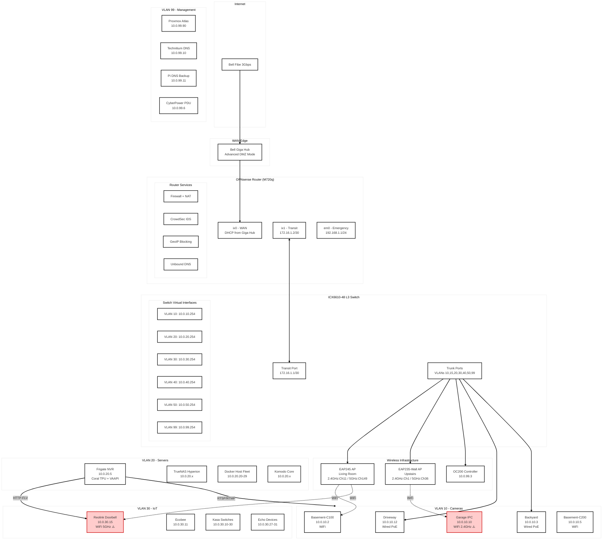
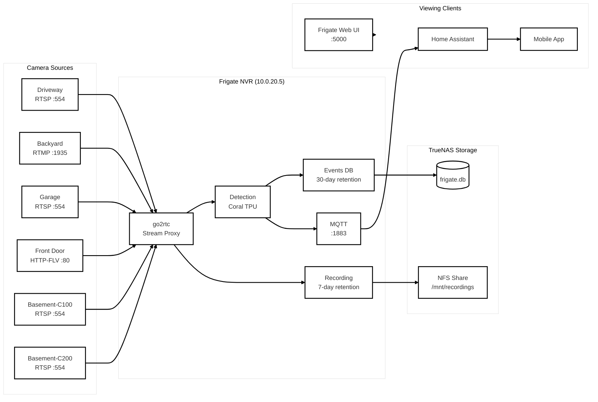

# Homelab Reference Architecture V2.5

This document is a **canonical reference** for the homelab. It is designed to be:
- Easy for an LLM to parse and reason about
- Explicit about intent vs implementation
- Free of ambiguity about routing, storage, and responsibility boundaries

When ambiguity exists, **this document is the source of truth**.

---

## 1. High-Level Intent

**Design goals:**
- Separate *compute*, *storage*, and *routing* responsibilities
- Keep storage traffic isolated at Layer-2
- Centralize routing and firewall policy in OPNsense
- Use enterprise-style patterns, but keep recovery simple

**Non-goals:**
- No hyper-converged storage
- No automatic east-west trust
- No routing inside storage networks

---

## 2. Physical Infrastructure

### 2.1 Compute — Proxmox VE ("Atlas")
- Platform: **Proxmox VE** (targeting 9.x)
- Node nickname: **Atlas**
- Hardware: Dell PowerEdge R730
- CPU: Dual Xeon E5-2630 v4 (20 cores total)
- RAM: 96 GB
- iDRAC: **Port 1/1/46 (R730-iDRAC)** — VLAN 99
- NIC0 (Mgmt): enp1s0f0 → 1 GbE → VLAN 99 untagged → **vmbr0** (10.0.99.90)
- NIC5 (Data): enxe41d2de5d822 → 40 GbE Mellanox ConnectX-3 → **vmbr1** VLAN trunk tagged (20,60,99) — **Port 1/2/6 (PVE-R730-40G-Core)**

### 2.2 Storage — TrueNAS SCALE ("Hyperion")
- Platform: **TrueNAS SCALE (25.10.x - Goldeye)**
- Node nickname: **Hyperion**
- Hardware: Supermicro X10SRH-CF
- CPU: Xeon E5-2620 v4
- RAM: 128 GB ECC
- NIC ens15 (Data): Mellanox ConnectX-3 40 GbE — **Port 1/2/1 (TrueNAS-40G-Core)**
- IPMI/Mgmt: 1 GbE — **Port 1/1/38 (TrueNAS-M)**

### 2.3 Backup — Proxmox Backup Server (PBS)
- Platform: **Proxmox Backup Server**
- Deployment: Dedicated standalone node
- Role: Immutable, deduplicated backups and primary recovery anchor

### 2.4 Network Core — Brocade ICX6610
- Switch: **Brocade ICX6610**
- Role: L2 core with limited, intentional L3 (Transit VLAN only)
- Management: VLAN 100 (10.0.100.0/24) — dedicated switch management VLAN
- **Port Map:** See Section 7.6 for physical cabling

### 2.5 Firewall / Router — OPNsense
- Platform: **OPNsense**
- Hardware: ThinkCentre M720q (Physical)
- WAN: ix0 — 10 GbE SFP+ to ISP
- Transit: ix1 — 10 GbE SFP+ — **Port 1/3/1 (OPNsense-10G-Core)**
- Backup Link: 10 GbE SFP+ — **Port 1/3/8 (OPNsense-10G-Backup)**
- Emergency Access: em0 — 1 GbE — 192.168.1.0/24 (direct wire bypass)
- Role: *Single source of truth* for all inter-VLAN routing and firewall policy

### 2.6 Additional Infrastructure (from DHCP reservations)
- CyberPower PDU: 10.0.99.6 (VLAN 99)
- OLD Proxmox Node (HP 400): 10.0.99.9 (VLAN 99) -Frigate
---

## 3. Storage Architecture (Authoritative)

### 3.1 Pools

#### boot-pool
- 2× 256 GB NVMe (mirror)
- Purpose: TrueNAS OS only

#### nvme-pool
- 2× 2 TB NVMe (mirror)
- Purpose: Latency-sensitive workloads
- Use cases:
  - Databases
  - App metadata
  - Redis / cache
  - **Docker App Configs**

#### nas-pool
- 7× 10 TB SAS (RAIDZ2)
- Purpose: Capacity + durability
- Use cases:
  - Media (Movies/TV)
  - Downloads (Torrents)
  - Backups (including PBS)

---

### 3.2 Dataset Rules

**General defaults:**
- compression = zstd
- atime = off

**Recordsize by workload:**
- Databases / metadata → 16K
- Mixed app data → 128K
- Media / backups → 1M

**Sync policy:**
- sync = disabled only for large sequential media
- sync = standard for databases

---

## 4. Proxmox Storage Usage

### 4.1 Local Proxmox Storage
- Pool: `vmdata`
- 3× 1 TB SSD (RAIDZ1)
- recordsize = 16K
- compression = zstd

Used for:
- VM OS disks
- Test VMs
- Non-critical workloads

### 4.2 External Storage (Authoritative Data)

All authoritative data lives on **TrueNAS** and is accessed via **NFS over VLAN 60**.

Each dataset is:
- Exported individually
- Mounted individually in Proxmox
- Bind-mounted into LXC containers

This preserves:
- Snapshot boundaries
- Clean ownership
- Easy migration

---

## 5. Application Placement

### 5.1 Runs on Proxmox (Atlas)
- Home Assistant OS (VM)
- Immich (DB, API, Redis)
- Paperless-ngx
- Mealie
- Technitium DNS (Primary) — 10.0.99.10
- Test / lab VMs

**Rule:** Proxmox is used for compute-heavy or multi-tier apps.

### 5.2 Runs on TrueNAS SCALE (Hyperion)
- **Container Management:** Dockge (managing multiple stacks)
- **VPN Stack (Docker):**
  - Gluetun (PIA OpenVPN, gateway for downloaders)
  - qBittorrent (Networked via Gluetun)
  - qSticky (Port forwarding sync)
- **Media Manager Stack (Docker):**
  - Sonarr (Connected to `shared_media_net`)
  - Radarr (Connected to `shared_media_net`)
  - Prowlarr (Connected to `shared_media_net`)
- **Native Apps (ix-applications):**
  - Jellyfin (Media Server, GPU access if available)

**Rule:** TrueNAS apps are storage-adjacent. *Arr apps and Downloaders run in Docker (Dockge) to unify networking, permissions, and hardlinking.

### 5.3 Standalone Services
- Technitium DNS (Secondary) — 10.0.99.11 — Raspberry Pi
- OC200 WiFi Controller — 10.0.99.3


### 5.4 Video Surveillance System

#### Frigate NVR
- **Host:** LXC/Docker on Proxmox (10.0.20.5)
- **Hardware Acceleration:** Intel VAAPI + Google Coral TPU (PCIe)
- **MQTT Broker:** 10.0.20.5:1883
- **Database:** /db/frigate.db
- **Features Enabled:**
  - Semantic Search (small model)
  - Face Recognition (small model)
  - Birdseye multi-camera view
  - 7-day continuous recording
  - 30-day event/alert retention

#### Camera Inventory

| Camera | Location | Model | IP | VLAN | Connection | Resolution | Protocol |
|--------|----------|-------|-----|------|------------|------------|----------|
| Driveway | Front yard | Hikvision | 10.0.10.12 | 10 | Wired (PoE) | 1080p+ | RTSP |
| Front Door | Entrance | Reolink Doorbell | 10.0.30.15 | 30 | WiFi 5GHz | 2K | HTTP-FLV |
| Backyard | Rear yard | Reolink | 10.0.10.3 | 10 | Wired (PoE) | 1080p+ | RTMP |
| Garage | Garage interior | IPC | 10.0.10.10 | 10 | WiFi 2.4GHz | 1080p | RTSP |
| Basement-C200 | Basement area 1 | Tapo C200 | 10.0.10.5 | 10 | WiFi/Wired | 1080p | RTSP |
| Basement-C100 | Basement area 2 | Tapo C100 | 10.0.10.2 | 10 | WiFi 2.4GHz | 1080p | RTSP |

#### Detection Objects
- Person (all cameras)
- Car (driveway only)
- Dog (backyard only)

#### Camera Groups
- **Outside:** Birdseye, Backyard, Garage, Driveway, Front Door
- **Inside:** Basement-C100, Basement-C200
---

## 6. Network Architecture (Critical)

### 6.1 VLAN Definitions

| VLAN | Purpose | Subnet | Routed? | Gateway | Role |
|------|---------|--------|---------|---------|------|
| 10 | Cameras | 10.0.10.0/24 | Yes | OPNsense | Isolated video feeds |
| 15 | Guest WiFi | 10.0.15.0/24 | Yes | OPNsense | **Internet-only, captive portal** |
| 20 | Servers | 10.0.20.0/24 | Yes | OPNsense | Primary Application Logic |
| 30 | IoT | 10.0.30.0/24 | Yes | OPNsense | Untrusted devices |
| 40 | Office / Family | 10.0.40.0/24 | Yes | OPNsense | General User endpoints |
| 50 | Trusted | 10.0.50.0/24 | Yes | OPNsense | **Primary Admin Workstation Source** |
| 60 | Storage | 10.0.60.x | **No** | None | **Layer-2 Only (NFS/iSCSI)** |
| 99 | Management | 10.0.99.0/24 | Yes | OPNsense | **Infrastructure Targets Only** |
| 100 | Switch Mgmt | 10.0.100.0/24 | Yes | OPNsense | **ICX6610 Management VLAN** |
| 200 | Transit | 172.16.1.0/30 | Yes | OPNsense | FW ↔ Switch routing interconnect |

### 6.2 Camera Inventory

**VLAN 10 (Isolated Cameras):**
- Driveway camera (Port 1/1/15)
- Backyard camera (Port 1/1/13)
- Garage camera (WiFi)
- Basement camera (WiFi)

**VLAN 30 (IoT / Semi-Trusted):**
- Doorbell camera

### 6.3 Storage VLAN Rule (Very Important)

**VLAN 60 MUST remain Layer-2 only.**
- No gateway
- No firewall interface
- No routing

Any IP on VLAN 60 exists **only on endpoints** (Atlas, Hyperion).

### 6.4 Guest Network (VLAN 15)

**Purpose:** Internet-only access for visitors

**Restrictions:**
- No access to RFC1918 (private networks)
- No access to DNS except internal Technitium
- Rate limited: 20 Mbps down / 5 Mbps up
- Captive portal: Click-through or simple password
- Session timeout: 8 hours
- **No logging of individual user passwords** (privacy)

**OPNsense Rules:**
```
Pass: VLAN 15 → DNS_SERVERS (TCP/UDP 53)
Pass: VLAN 15 → !RFC1918 (Internet only)
Block: VLAN 15 → any (implicit deny)
```

### 6.5 DNS Architecture

**Technitium DNS Cluster:**
- Primary: 10.0.99.10 (LXC on Proxmox Atlas)
- Secondary: 10.0.99.11 (Raspberry Pi)
- Mode: Clustered for redundancy

**Integration:**
- OPNsense Unbound: Forwards to Technitium cluster
- All VLANs: DHCP pushes 10.0.99.10, 10.0.99.11
- External DNS blocked: IoT (VLAN 30), Cameras (VLAN 10)

---

## 7. Switch (ICX6610) Behavior

### 7.1 Role
- High-speed L2 core
- VLAN separation
- No policy enforcement (firewall is OPNsense)

### 7.2 Allowed L3
- Transit VLAN 200 only (optional VE interface)

### 7.3 Management Access
- VLAN 100 (10.0.100.0/24): Dedicated switch management
- Static route in OPNsense: 10.0.100.0/24 via Transit_Gateway
- Config upload/download via dedicated port

### 7.4 Port Policy
- Atlas (Proxmox) + Hyperion (TrueNAS) 40G ports:
  - tagged: 20, 60, 99
- Omada AP ports:
  - Trunk ports
  - Tagged VLANs: 10, 15, 30, 40, 50, 99

### 7.5 Design Rule
If routing decisions are required → they belong in **OPNsense**, not the switch.


### 7.6 Physical Port Map (Active Infrastructure)
*Source: Switch CLI Configuration*

| Port | Speed | CLI Name / Label | Purpose |
|:-----|:------|:-----------------|:--------|
| **Core / Uplinks** ||||
| 1/2/1 | **40G** | `TrueNAS-40G-Core` | **TrueNAS Primary Data** |
| 1/2/6 | **40G** | `PVE-R730-40G-Core` | **Proxmox Primary Data** |
| 1/3/1 | **10G** | `OPNsense-10G-Core` | **Router LAN Primary** |
| 1/3/8 | **10G** | `OPNsense-10G-Backup` | Router LAN Backup |
| 1/1/1 | 1G | `OPNsense` | Router Mgmt / Copper |
| **Servers / Nodes** ||||
| 1/1/46 | 1G | `R730-iDRAC` | Dell R730 Mgmt |
| 1/1/38 | 1G | `TrueNAS-M` | Supermicro Mgmt/IPMI |
| 1/1/36 | 1G | `OC200-Controller` | WiFi Controller |
| 1/3/3 | **10G** | `PVE-HP-G4-SFF-10G` | Proxmox Node (Secondary) |
| 1/3/4 | **10G** | `TrueNAS-Lenovo-10G` | Backup / Replication Target |
| 1/1/40 | 1G | `PM-1` | Proxmox Node (Tertiary) |
| 1/1/42 | 1G | `PM-2` | Proxmox Node (Quaternary) |
| 1/1/44 | 1G | `PM-3` | Proxmox Node (Quinary) |
| 1/1/45 | 1G | `IDRAC` | PM Node iDRAC |
| **Wireless** ||||
| 1/1/7 | 1G | `MBR-EAP235-Wall` | Upstairs AP (PoE) |
| 1/1/9 | 1G | `LivingRoom-EAP245` | Living Room AP (PoE) |
| **Clients / IoT** ||||
| 1/1/2 | 1G | `TC-1` | Thin Client 1 |
| 1/1/4 | 1G | `TC-2` | Thin Client 2 |
| 1/1/6 | 1G | `TC-3` | Thin Client 3 |
| 1/1/3 | 1G | `TV ROOM-M` | Media Device |
| 1/1/5 | 1G | `TV ROOM` | Living Room TV |
| 1/1/21 | 1G | `Basement-TV-Media` | Basement Media |
| 1/1/13 | 1G | `POE-Backyard-Cam` | Camera (VLAN 10) |
| 1/1/15 | 1G | `POE-DriveWay-Cam` | Camera (VLAN 10) |
| 1/1/25 | 1G | `Switch-Access` | Admin Access / Downlink |

---

## 8 Omada AP Infrastructure

### 8.1 Wireless Infrastructure
- Controller: **OC200** v6.1.0.19 (Port 1/1/36) — 10.0.99.3
- Access Points:
  - **EAP245** (Port 1/1/9) — Living Room — 10.0.99.2 — Device heavy
  - **EAP235-Wall** (Port 1/1/?) — Basement — 10.0.99.? (update)
  - **EAP235-Wall** (Port 1/1/7) — Upstairs — 10.0.99.100 — Human traffic

| AP | Model | Location | IP | 2.4GHz Ch | 5GHz Ch | Clients | Notes |
|----|-------|----------|-----|-----------|---------|---------|-------|
| EAP235-Wall | v1.0 | Upstairs | 10.0.99.100 | **1** (20MHz) | **36** (80MHz) | 6 | Wall-mounted, 2×2 MIMO |
| EAP245 | v3.0 | Living Room | 10.0.99.2 | 11 (20MHz) | 149 (80MHz) | 17 | Ceiling, 3×3 MIMO |
| EAP110-Outdoor | - | Outdoor | 10.0.99.254 | TBD | N/A | - | 2.4GHz only |

### 8.2 Channel Plan (Updated 2026-02-08)

```
2.4 GHz Spectrum (Non-overlapping channels)
┌─────────────┬─────────────┬─────────────┐
│  Channel 1  │  Channel 6  │  Channel 11 │
│  EAP235-Wall│   (unused)  │   EAP245    │
│  Upstairs   │             │ Living Room │
└─────────────┴─────────────┴─────────────┘

5 GHz Spectrum (Separated bands)
┌─────────────────────┬─────────────────────┐
│  UNII-1 (36-48)     │  UNII-3 (149-165)   │
│  Channel 36 (80MHz) │  Channel 149 (80MHz)│
│  EAP235-Wall        │  EAP245             │
└─────────────────────┴─────────────────────┘
```

### 8.3 SSIDs

| SSID | Band | VLAN | Purpose | Band Steering |
|------|------|------|---------|---------------|
| Base | Dual | 99 | Admin access | Recommended |
| IOT-30 | Dual | 30 | IoT devices | Enable |
| IoT-Cam | Dual | 10 | Cameras only | Enable |
| Tanuja-2Ghz | 2.4GHz | 40 | Family (legacy) | N/A |
| Tanuja2-5GZ | 5GHz | 40 | Family (5GHz) | N/A |

**Recommendation:** Merge Tanuja-2Ghz and Tanuja2-5GZ into single SSID with band steering enabled.

### 8.4 WiFi-Connected Cameras

| Camera | SSID | Band | AP | Signal | SNR | Issue |
|--------|------|------|-----|--------|-----|-------|
| Garage (IPC) | IoT-Cam | 2.4GHz Ch1 | Upstairs | -47dBm (100%) | 48 | High bandwidth (10GB/day) |
| Basement-C100 | IoT-Cam | 2.4GHz Ch11 | Living Room | -59dBm (77%) | 36 | OK |
| Front Door | IOT-30 | 5GHz Ch149 | Living Room | -76dBm (35%) | 19 | ⚠️ Weak signal, high bandwidth |

### 8.5 Recommended Settings

| Setting | Location | Value |
|---------|----------|-------|
| Band Steering | Per SSID | Enable, Prefer 5GHz |
| Fast Roaming (802.11r) | Site Settings | Enable |
| Non-Stick Roaming | Site Settings | -70 dBm |
| Auto WLAN Optimization | Site Settings | Incompatible (WiFi 5 APs) |


---

## 9. Firewall & Router (OPNsense)

### 9.1 Responsibilities
- All inter-VLAN routing
- Firewall policy
- DHCP (all VLANs except 60)
- DNS forwarding to Technitium
- IDS/IPS (Suricata on WAN)
- GeoIP blocking

### 9.2 Security Posture
- Default deny mindset
- Explicit allow rules per VLAN
- IoT and Camera VLANs blocked from RFC1918
- Guest VLAN (15) internet-only
- Management VLAN (99) blocked from WAN except update hosts
- **IPv6:** Disabled on internal server interfaces

### 9.3 Administration Model (Tiered Security)
- **Command PC (VLAN 50):** Primary workstation sits on VLAN 50 (Trusted)
- **Access Rule:** Firewall permits **Single Host (Command PC)** → **VLAN 99 (Mgmt)** on specific ports (443, 80, 22, 8006, ICMP)
- **Emergency Access:** 192.168.1.0/24 on em0 — direct wire bypass for router recovery
- **Isolation:**
  - VLAN 99 does **not** have internet access (except specific update mirrors)
  - VLAN 99 cannot initiate connections to Trusted/IoT/Camera VLANs
  - PC on VLAN 50 accesses TrueNAS via OPNsense Gateway (symmetric 10G/40G routing)

### 9.4 IDS/IPS Configuration
- Engine: Suricata
- Mode: IPS (blocking enabled)
- Interface: WAN only
- Rulesets: ET Open, Abuse.ch SSL Blacklist, Abuse.ch URLhaus
- Categories: emerging-malware (drop), emerging-exploit (drop), emerging-dos (drop)

### 9.5 GeoIP Blocking
- Enabled on WAN interface
- Blocked countries: CN, RU, KP, IR (customize as needed)
- Direction: Both inbound and outbound

### 9.6 Threat Intelligence Feeds
- Spamhaus DROP: URL table, daily update
- Spamhaus EDROP: URL table, daily update
- Applied: WAN inbound, ALL_VLAN outbound

### 9.7 Threat Intelligence (Active)
- Spamhaus DROP/EDROP: URL tables, daily update
- GeoIP Blocking: Africa, CN, RU, KP, IR, AF, IQ blocked
- CrowdSec: Agent + LAPI + Firewall Bouncer enabled


### 9.8: Firewall Rules for Video Surveillance

| # | Source | Destination | Port | Proto | Action | Description |
|---|--------|-------------|------|-------|--------|-------------|
| 1 | 10.0.20.5 (Frigate) | 10.0.10.0/24 | 554 | TCP | Allow | RTSP to wired cameras |
| 2 | 10.0.20.5 (Frigate) | 10.0.10.0/24 | 1935 | TCP | Allow | RTMP to Reolink cams |
| 3 | 10.0.20.5 (Frigate) | 10.0.10.0/24 | 8554 | TCP | Allow | go2rtc restream |
| 4 | 10.0.20.5 (Frigate) | 10.0.30.15 | 80,1935 | TCP | Allow | Doorbell HTTP-FLV |
| 5 | 10.0.10.0/24 | 10.0.20.5 | 1883 | TCP | Allow | MQTT events |
| 6 | 10.0.10.0/24 | RFC1918 | Any | Any | Block | Cameras can't reach other VLANs |
| 7 | 10.0.10.0/24 | WAN | Any | Any | Block | Cameras isolated from internet |
| 8 | 10.0.50.0/24 | 10.0.20.5 | 5000,8971 | TCP | Allow | Frigate UI from Trusted |
| 9 | 10.0.40.0/24 | 10.0.20.5 | 5000,8971 | TCP | Allow | Frigate UI from Family |

---

## 10. Failure & Recovery Philosophy

- Atlas (Proxmox) can boot independently of Hyperion (TrueNAS)
- Hyperion is the authoritative data source for media and backups
- Storage mounts may fail gracefully if Hyperion is offline
- Proxmox Backup Server (PBS) is a **dedicated standalone node**
- PBS repositories are stored on Hyperion (nas-pool)
- TrueNAS datasets (apps + media) are protected via ZFS snapshots
- App configuration recovery is snapshot-based, not re-deploy-based
- **OPNsense emergency access:** Direct wire to em0 (192.168.1.0/24)

---

## 11. Rules for Future Changes

When modifying the homelab:
1. Do not mix routing responsibilities
2. Do not add gateways to VLAN 60
3. Do not move complex apps onto TrueNAS
4. Update **this document** first

### 11.1 Network Tuning Standards
1. **IPv6:** Explicitly **DISABLED** on TrueNAS interfaces (`ens15`, `eno1`) to prevent UI timeouts and container routing delays
2. **MTU:** Keep at **1500 (Standard)** across the board. Jumbo frames (9000) not used for compatibility between Management (1G) and Data (40G) VLANs
3. **Docker Registry:** Use `linuxserver/` (Docker Hub) images instead of `lscr.io` to avoid routing MTU/timeout blackholes

### 11.2 SNMP Configuration
- Community string: **Use strong random string** (not "public")
- Access: Management VLAN only

---

## 12. Networking Diagram (Mermaid)




## Camera Data Flow Diagram



---

## 13. Reference Links

- Brocade CLI Notes: https://wiki.nycmesh.net/books/5-networking/page/brocade-router-cli-notes
- OPNsense Documentation: https://docs.opnsense.org/
- Technitium DNS: https://technitium.com/dns/
- Omada Controller: https://www.tp-link.com/us/omada-sdn/

---

## Appendix A: IP Address Quick Reference

| Device | IP Address | VLAN | Notes |
|--------|------------|------|-------|
| OPNsense (Transit) | 172.16.1.2 | 200 | Router side |
| ICX6610 (Transit) | 172.16.1.1 | 200 | Switch VE |
| ICX6610 (Mgmt) | 10.0.100.x | 100 | Switch management |
| Technitium DNS #1 | 10.0.99.10 | 99 | LXC on Proxmox |
| Technitium DNS #2 | 10.0.99.11 | 99 | Raspberry Pi |
| OC200 Controller | 10.0.99.3 | 99 | WiFi Controller |
| EAP245 | 10.0.99.2 | 99 | Living Room AP |
| EAP235-Wall | 10.0.99.100 | 99 | Upstairs AP |
| TrueNAS (Data) | 10.0.20.x | 20 | Primary data interface |
| TrueNAS (Storage) | 10.0.60.10 | 60 | NFS only |
| Proxmox Atlas (Mgmt) | 10.0.99.90 | 99 | NIC0/vmbr0 |
| Proxmox Atlas (Data) | vmbr1 | 20,60,99 | NIC5/VLAN trunk |
| Docker Host Fleet | 10.0.20.20-29 | 20 | Convention-based (fleet-create.yml) |
| Komodo Core | 10.0.20.x | 20 | Planned migration from VLAN 99 |
| Command PC | 10.0.50.2 | 50 | Admin workstation |
| OPNsense Emergency | 192.168.1.1 | N/A | Direct wire access |


### VLAN 10 - Cameras (10.0.10.0/24)

| IP | Hostname | Device | Connection |
|----|----------|--------|------------|
| 10.0.10.1 | - | Gateway (OPNsense) | - |
| 10.0.10.2 | Basement-C100 | Tapo C100 | WiFi 2.4GHz |
| 10.0.10.3 | Backyard | Reolink (outdoor) | Wired PoE |
| 10.0.10.5 | Basement-C200 | Tapo C200 | WiFi |
| 10.0.10.10 | Garage | IPC camera | WiFi 2.4GHz |
| 10.0.10.12 | Driveway | Hikvision | Wired PoE |

### VLAN 20 - Servers (10.0.20.0/24)

| IP | Hostname | Device | Notes |
|----|----------|--------|-------|
| 10.0.20.1 | - | Gateway (OPNsense) | - |
| 10.0.20.5 | Frigate | NVR + MQTT | Coral TPU, VAAPI |
| 10.0.20.x | Komodo Core | Container management | Planned migration from VLAN 99 |
| 10.0.20.20 | docker-host-01 | Docker host (fleet) | VMID 201 |
| 10.0.20.21 | docker-host-02 | Docker host (fleet) | VMID 202 |
| 10.0.20.22 | docker-host-03 | Docker host (fleet) | VMID 203 |
| 10.0.20.X | ntopng | Traffic analysis | Planned |

### VLAN 30 - IoT (10.0.30.0/24)

| IP | Hostname | Device | Notes |
|----|----------|--------|-------|
| 10.0.30.3 | AlarmSys | Alarm panel | Static ARP |
| 10.0.30.4 | Samsung-FamilyHub | Smart fridge | WiFi 2.4GHz |
| 10.0.30.10 | KS220M | Kasa smart switch | WiFi |
| 10.0.30.11 | My-ecobee | Thermostat | WiFi 2.4GHz |
| 10.0.30.15 | Reolink | **Doorbell camera** | WiFi 5GHz ⚠️ |
| 10.0.30.20-30 | HS220/KS200M | Kasa switches | WiFi 2.4GHz |
| 10.0.30.26 | dreame_vacuum | Robot vacuum | WiFi 2.4GHz |
| 10.0.30.27-31 | amazon-* | Echo devices | WiFi mixed |

---

*Document Version: 2.5*
*Last Updated: 2026-02-09*
*Changes: Fixed Frigate IP (10.0.20.5), fixed Proxmox Atlas NIC/VLAN config, added docker host fleet (10.0.20.20-29), planned Komodo Core migration to VLAN 20, added port 8006 to admin access rule, fixed Mermaid diagram*
